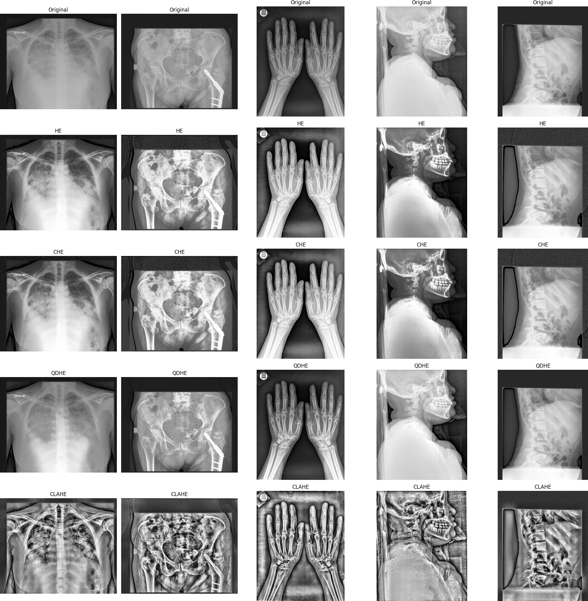

# Poboljšanje medicinskih slika zasnovano na algoritmima histograma

## Opis Projekta

Poboljšanje medicinskih slika predstavlja ključni korak u dijagnostici i lečenju pacijenata, jer kvalitet slike direktno utiče na sposobnost lekara da pravilno tumači anatomske strukture i identifikuje potencijalne probleme. Zbog prirode medicinskih slika, koje često pate od problema kao što su niski kontrast i šum, važno je primeniti tehnike poboljšanja kako bi se obezbedila što jasnija i preciznija vizuelna informacija.

Jedan od najčešće korišćenih pristupa za poboljšanje kontrasta slike je izjednačavanje histograma (HE). Međutim, HE može generisati neželjene artefakte i prekomerno pojačanje kontrasta u određenim delovima slike. Da bi se rešili ovi problemi, razvijeni su različiti napredni algoritmi zasnovani na histogramu, kao što su kumulativno izjednačavanje histograma (CHE), kvadratno dinamičko izjednačavanje histograma (QDHE), i kontrastno ograničeno adaptivno izjednačavanje histograma (CLAHE).

Ovaj projekat analizira i upoređuje performanse ovih algoritama na različitim slikama. Kroz implementaciju i analizu rezultata pokazujemo prednosti i nedostatke svakog od pristupa.

## Instalacije

Da biste instalirali sve potrebne biblioteke za rad sa projektom, pokrenite sledeću komandu
```bash
pip install matplotlib numpy opencv-python
```


## Algoritmi


### Izjednačavanje Histograma (HE)

Izjednačavanje histograma transformiše vrednosti intenziteta slike tako da budu ravnomerno raspoređene po celom mogućem rasponu.

### Kumulativno Izjednačavanje Histograma (CHE)

CHE koristi kumulativnu distribuciju histograma za poboljšanje kontrasta slike. Ova metoda normalizuje kumulativnu distribuciju i primenjuje je na sliku.

### Kvadratno Dinamičko Izjednačavanje Histograma (QDHE)

QDHE poboljšava kontrast slike koristeći particionisanje histograma, skraćivanje histograma i izjednačavanje histograma za svaki pod-histogram.

### Kontrastno Ograničeno Adaptivno Izjednačavanje Histograma (CLAHE)

CLAHE poboljšava kontrast slike i smanjuje šum koristeći adaptivnu podelu slike u male regione i primenom ograničenja na histogram svakog regiona.

## Rezultati primena ovih algoritama

Na slici ispod su prikazane originalne slike i rezultati primena gore navedenih algoritama.



## Skup podataka

Za analizu su korišćene slike iz test skupa podataka sa [Kaggle](https://www.kaggle.com/datasets/ibombonato/xray-body-images-in-png-unifesp-competion). Ovaj skup se sastoji od 743 slika u PNG formatu koje predstavljaju rendgenske snimke različitih delova ljudskog tela. Sve slike su u 8-bit depth grayscale formatu, što znači da svaka slika koristi 8 bita za prikaz nijansi sive boje.


## Mera uspešnosti algoritma

Za merenje uspešnosti algoritama korišćene su tri metrike (srdednja kvadratna greška, odnos pika signala i šuma i standardna devijacija). Ove metrike su računate na podacima iz prethodno navedenog skupa podataka i uprosečene su na njemu. Rezultati merenja pokazuju da svi algoritmi poboljšavaju originalnu sliku (u smislu da pojačavaju kontrast u njoj), ali da druge dve metode prave manje artefakte pri tom povećanju kontrasta. Glavni razlog toga je što je njihov pristup obrade slike lokalan, čime se pravi manji šum.

### Testiranje

1. **Preuzmite skup podataka**: Skinite skup podataka sa [navedenog linka](https://www.kaggle.com/datasets/ibombonato/xray-body-images-in-png-unifesp-competion).

2. **Pripremite podatke za testiranje**:
    - Otvorite preuzeti skup podataka i pronađite folder sa test slikama.
    - Prekopirajte slike iz `test` foldera preuzetog skupa podataka u `test` folder u vašem projektu.

Ovo će vam omogućiti da izmerite mere uspešnosti algoritama na stvarnim podacima.


## Literatura

[Medical image enhancement based on histogram algorithms](https://www.sciencedirect.com/science/article/pii/S1877050919321519)

[Quadrants Dynamic Histogram Equalization for Contrast Enhancement](https://www.researchgate.net/publication/224209840_Quadrants_Dynamic_Histogram_Equalization_for_Contrast_Enhancement)

## Članovi tima

Marina Vasiljević 1061/2023

Isidora Burmaz 1057/2023


